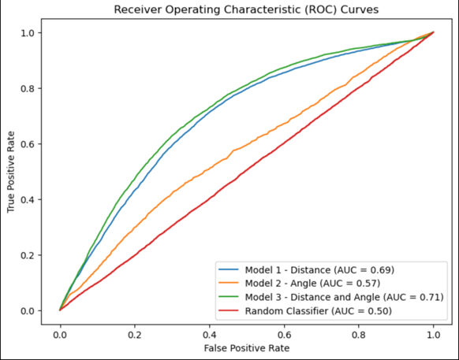
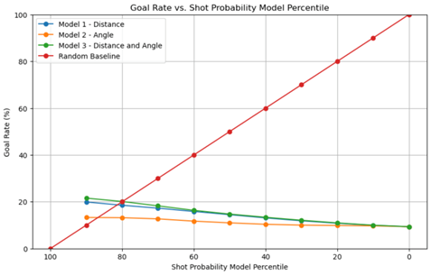
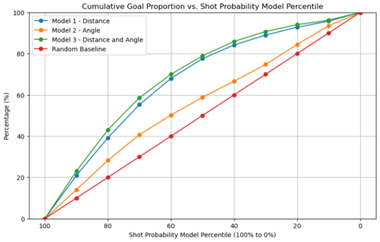
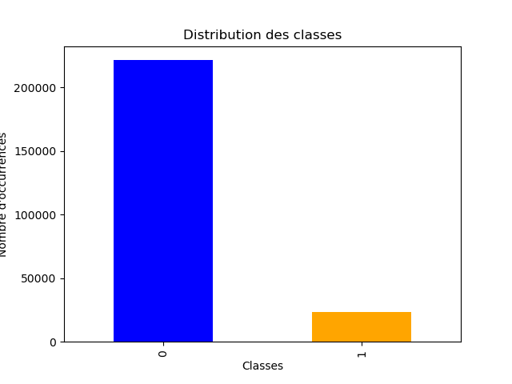
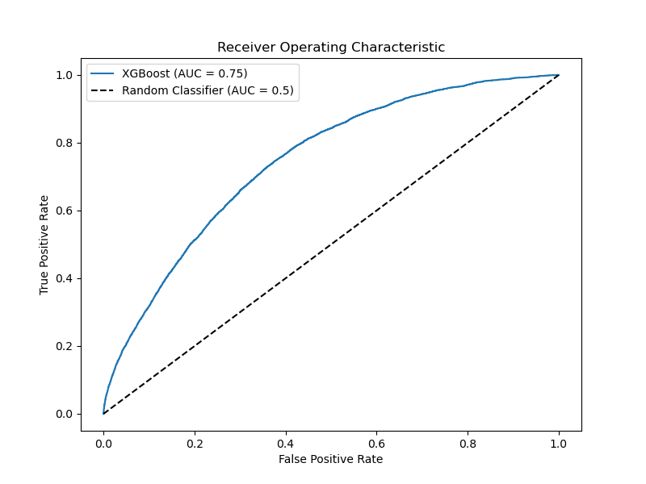
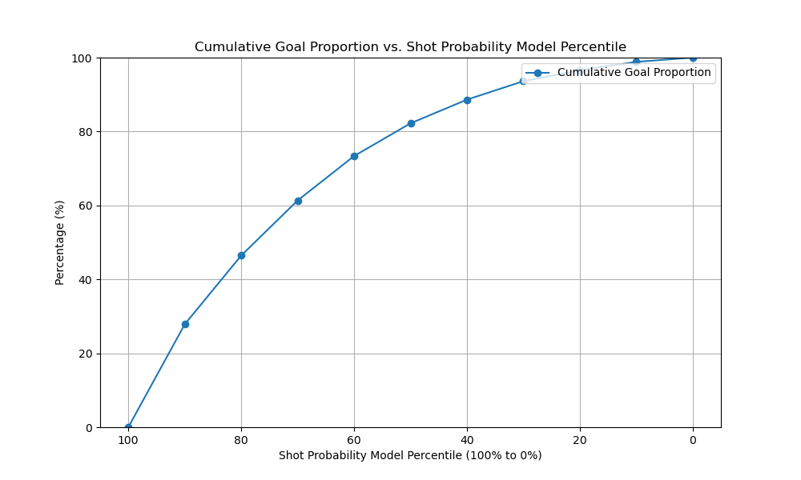
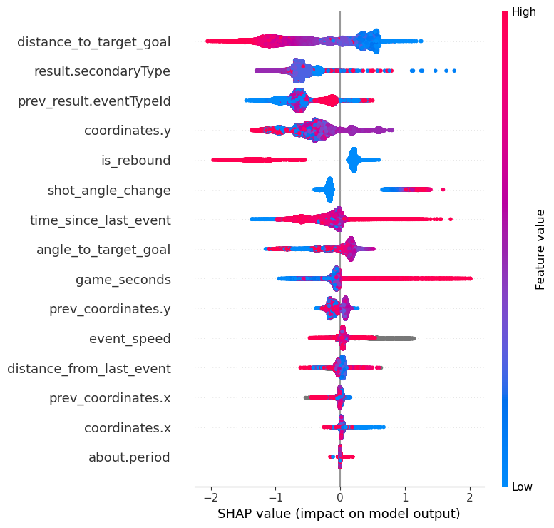
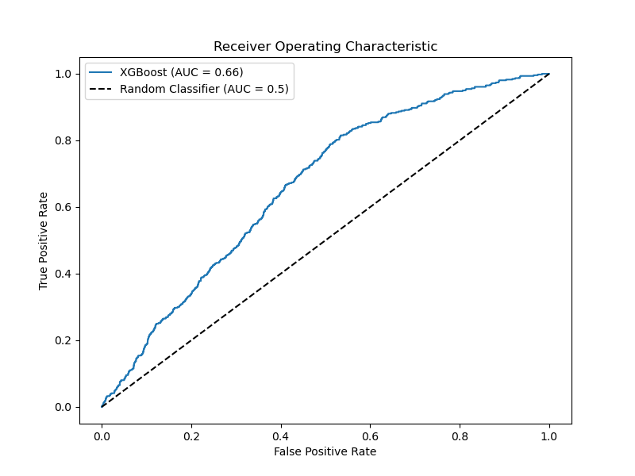

## Partie 2:  Ingénierie des caractéristiques I 
**Question 1**<br>
	

Sur cet histogramme, il est possible de réaliser que la majorité des tirs et des buts proviennent d’une distance circonscrite entre 0 et 60 pieds. Il semble y avoir une distance où il y a plus de tirs et plus de but dans les environs de 10-15 pieds, puis plus on s’éloigne de cette distance, plus le nombre de buts diminue. 

	

Sur cet histogramme, en un coup d'œil, nous pouvons déceler qu’il semble y avoir 3 pics pour les sites de prédilection pour les tirs, soit 90, 60 et 45 degrés. À garder en tête que nous avons fait une échelle de 0 à 90 donc les valeurs inférieures à 90 représentent les valeurs pour les deux côtés de la patinoire. Nous avons préféré ce mode de représentation parce que les angles opposés (par exemple 45 et 135) représentent la même visualisation du filet et l’aire du filet disponible pour le tir (avec ou sans gardien). Il est facile de voir que plus l’angle diminue à partir de 90 degré, plus le nombre de buts diminue. Plus il y a un angle, moins de filet disponible et visible pour un but est présent lorsqu’un gardien est positionné correctement. 	

		

Il est possible de voir que la majorité des tirs sont produits le plus prêt du filet possible et à un angle se rapprochant le plus de 90 degré parce que ça semble être des caractéristiques liées au taux de succès pour marquer un but. Cependant, il faudra analyser plus parce que le taux de buts plus élevés avec ses caractéristiques pourraient être seulement dû à la fréquence plus augmentée de ces évènements. 	

**Question 2**<br>	
<<<<<<< HEAD

			
			

En regardant le taux de buts par groupe de distance en pieds, il est possible de voir une tendance que les tirs les plus dangereux semblent être ceux effectués près du filet. La recrudescence des buts à partir de la distance de 100 pieds est due aux buts dans les filets déserts et aux événements mal classés. Effectivement, comme peu de tirs sont effectués à cette distance quand le gardien en en position dans le but, le taux de buts à ces distances sont expliqués par les buts en filet désert. On peut réaliser dans la figure de droite en retirant ces buts que le taux de buts diminue plus on s’éloigne du filet. 	

		

En un simple coup d'œil, il est possible de voir que plus on s’éloigne de l’angle de 90 degré, moins les tirs sont efficaces pour marquer des buts comme le taux de buts diminue. Cependant, l’effet est moins marqué que celui de la distance et il y a un effet plateau entre 70 et 30 degrés où les taux sont similaires. À noter encore que les groupes d’angle sous les 90 degré représente les angles à gauche et à droite du gardien, alors l’importance d’être près du 90 degré ici est minimisée.	

			

Ici, nous avons dû faire une transformation en base logarithmique pour mieux déceler et comparer les deux entités parce que la différence en termes de nombre d'événements entre les deux catégories est trop importante. Il est possible de voir que le nombre de buts en filet désert est assez constant à travers toutes les distances et dépasse le nombre de buts marqués avec un gardien présent à environ 70 pieds du filet. Il est possible de penser que les événements où un but est marqué à une distance plus grande que 100 pieds lorsque le gardien est présent sont rarissimes et qu’une partie d’entre eux ont des erreurs au niveau de l'enregistrement de leurs coordonnées dans le jeu de données initial. 	

Pour identifier les événements qui étaient possiblement mal classés en termes de coordonnées, il suffisait d’utiliser l'intuition de nos connaissances de hockey et de celle acquise avec la visualisation des données en observant les buts réalisés avec un gardien présent à des distances plus hautes. Voici un exemple d’évènements repéré:	
0,2,2015-10-08T00:21:09Z,Toronto Maple Leafs,GOAL,-73.0,-1.0,Deflected,False,Power Play,James van Riemsdyk,Carey Price,2015020001,regular	

En 2015, en deuxième période, les Maple Leafs tiraient sur le but (89,0) et donc un tir dévié sur le power play provenait le plus probablement des coordonnées (73, -1). Comme on peut voir sur la photo prise d'une vidéo youtube d'un récapitulatif de la chaîne TVA sport, James van Riemsdyk est le joueur positionné directement devant le gardien Carey Price. 	


## Partie 3: Modèles de base

La précision du modèle est de 90% d’accuracy pour un modèle de régression logistique de base ce qui me semble trop élevé pour un classifieur de base basé seulement sur la distance. Un problème que je vois pourrait être que le classifieur ne fait qu’utiliser le taux de buts par distance, qui diminue plus la distance augmente, pour faire sa prédiction. Comme les buts sont relativement rares, le modèle n’a qu’à prédire légèrement plus de buts que le taux de buts par distance pour avoir une performance adéquate. Cependant, ce type de modèle, si utilisé sur d'autres données va faire des erreurs par exemple s’il y a un tir effectué de très loin vers un filet désert, des tirs de la ligne bleue lors d’avantage numérique, d’autant plus à 5 contre 3 etc. De plus, si on veut un modèle de plus en plus précis en analysant plus de données, la composante binaire nous intéresse moins que la probabilité que le tir soit un but. 	



Il est possible de voir qu’entre les caractéristiques de distance et d’angle, celle de distance est plus discriminante pour savoir si un tir sera un but ou non. Nous avions déjà développé cette intuition en regardant les graphiques de taux de buts par distance et par angle. Après 90 degrés, le taux de buts par angle frappe un plateau de 70 à 30 degrés tandis que le taux de buts par distance ne cesse de diminuer plus la distance augmente. On peut voir que lorsqu’on combine l’angle et la distance, le modèle performe légèrement mieux en terme de discrimination. 	

	

Il est possible de voir encore une fois la même tendance, c'est-à-dire que la prédiction par le modèle est meilleure en termes de percentile en considérant le taux de but par distance que par angle pour les mêmes raisons qu'évoqué plus tôt. Encore une fois le modèle combiné performe légèrement mieux que celui de la distance seul.

	

Il est possible de voir encore une fois la même tendance, c'est-à-dire que la prédiction par le modèle est meilleure en termes de percentile en considérant le taux de but par distance que par angle pour les mêmes raisons qu'évoqué plus tôt. Encore une fois le modèle combiné performe légèrement mieux que celui de la distance seul. Le modèle par angle offre un performance légèrement meilleure que le modèle aléatoire de base. 	

 	
 
On voit qu’ajouter une variable pour que notre modèle soit plus précis fonctionne. Cependant, comme nous n’avons que fait des modèles de bases, nous atteignons à peine le 0,4 de probabilité prédite moyenne avec notre meilleur modèle, soit celui de la distance et de l’angle combiné. Il faudra très probablement inclure plus de caractéristiques plus complexes dans les prochaines étapes du projet pour faire des modèles se rapprochant de la ligne de la calibration parfaite. 	
**Lien vers lien vers l'expérience qui stocke l'artefact DataFrame filtré pour le jeu spécifié:
[LienExperiance](https://www.comet.com/francis75/nhl-project/ae00b99b5c464daba590a450f1c7441b)

## Partie 4: Ingénierie des caractéristiques 2

**Liste des caractéristiques créés**<br> 
1. game_seconds: Temps ecoulé depuis debut de la periode en secondes
2. about.period: Periode de jeu
3. shot_distance: Distance de tir
4. shot_angle: Angle de tir
5. last_event_type: Dernier événement avant celui actuel 
6. last_event_y: Position y du dernier événement
7. last_event_x: Position x du dernier événement
8. time_since_last_event: Temps ecoulé depuis le dernier événement en secondes
9. distance_from_last_event: Distance séparant l'événement actuel de l'événement précedent
10. is_rebound: Valeur booléene indiquant si l'événement est un tir
11. shot_angle_change: Changement d'angle après un tir
12. event_speed: Vitesse de l'événement en cours
13. power_play_timer: Temps écoulé depuis le début du jeu de puissance en secondes
14. friendly skaters on ice: Le nombre de patineurs dans l'équipe actuelle
15. Opponents skaters on ice: Le nombre de patineurs de l'équipe adverse

**Lien vers lien vers l'expérience qui stocke l'artefact DataFrame filtré pour le jeu spécifié:
[LienExperiance](https://www.comet.com/francis75/feature-engineering-data/cb1bac468bcd4f23b0f6fb8a25e17af2)


## Partie 5 : Modèles avancés 


**Question 1:**<br>

Dans cette partie, nous avons utilisé un modèle XGBoost avec les hyperparamètres par défaut qui sont définis par la bibliothèque XGBoost elle-même. Notez que nous utilisons XGBClassifier sans aucun argument, ce qui signifie que nous utilisons ceux par défaut. 


Les résultats trouvés :


On constate que qu'il n'y a pas de grande différence avec le modéle de regression logistique entrainé sur distance et angle. Mais au niveau du diagramme de fiabilité le modéle XGBoot qui oscille avant d'atteindre une valeur maximal.

[ExperianceXGBoostPartI](https://www.comet.com/francis75/nhl-projectvf/6b43466fcbd4409cb29e4a5f6f1a00bf)


**Question 2:**<br>

Préparation des données :

1. Encoder des variables catégorielles : L'algorithme XGBoost fonctionne avec des types numériques et vu que notre dataset contient des valeurs catégoriallles on a la techniques encodage leave on out. 


2. Nettoyez les données :

Pour les valeurs manquantes : nous avons eu le résultat suivant :
 ```python
                                              Missing Values  Percentage
distance_to_target_goal                                   17    0.005559
angle_to_target_goal                                      17    0.005559
about.period                                               0    0.000000
game_seconds                                               0    0.000000
coordinates.x                                             16    0.005232
coordinates.y                                             15    0.004905
prev_coordinates.x                                      4157    1.359323
prev_coordinates.y                                      4156    1.358996
time_since_last_event                                      0    0.000000
distance_from_last_event                                4169    1.363247
is_rebound                                                 0    0.000000
shot_angle_change                                         10    0.003270
event_speed                                            10783    3.525999
shot_or_goal                                               0    0.000000
prev_result.eventTypeId_smoothed_loo_encoded               0    0.000000
result.secondaryType_smoothed_loo_encoded                 42    0.013734
```
On voit une variation de pourcentage des données manquantes pour les variables :
Les variables qui n'ont pas de valeurs manquantes :
shot_or_goal : Aucune valeur manquante (0%)
time_since_last_event : Aucune valeur manquante (0%)
is_rebound : Aucune valeur manquante (0%)
about.period : Aucune valeur manquante (0%)
game_seconds : Aucune valeur manquante (0%)
prev_result.eventTypeId_smoothed_loo_encoded : Aucune valeur manquante (0%)

Les variables qui ont des valeurs manquantes trés faible :
distance_to_target_goal : 17 valeurs manquantes (0.005559%)
angle_to_target_goal : 17 valeurs manquantes (0.005559%)
coordinates.x : 16 valeurs manquantes (0.005232%)
coordinates.y : 15 valeurs manquantes (0.004905%)
shot_angle_change : 10 valeurs manquantes (0.003270%)
result.secondaryType_smoothed_loo_encoded : 42 valeurs manquantes (0.013734%)

Les variables qui ont des valeurs manquantes faible :
distance_from_last_event : 4169 valeurs manquantes (1.363247%)
prev_coordinates.x : 4157 valeurs manquantes (1.359323%)
prev_coordinates.y : 4156 valeurs manquantes (1.358996%)

Pour la variable event_speed 3.53% de valeurs manquantes n'est pas négligeable, mais ce n'est pas non plus extrêmement élevé. Et vu qu'on a pas encore etudié l'importance de cette variable pour l'analyse de notre modèle on ne va pas la supprimer : 
event_speed : 10783 valeurs manquantes (3.525999%)

Nous allons tester en premier temps, XGBoost missing parameter avant de passer à une autre solution.

3. Normaliser/standardiser les données : 

Vu que XGBoost, en tant qu'algorithme de gradient boosting, n'est généralement pas sensible à l'échelle des caractéristiques et gère bien les caractéristiques avec des échelles différentes, nous n'avons pas effectuer aucune opération pour normaliser nos données. 

4. Déséquilibre des classes :

Nous avons évaluer l'équilibre de nos étiquettes, et on a eu les résultats suivantes : 

 ```python
shot_or_goal
0    276782
1     29032
```


En regardant les résultats, on peut voir que la classe 0 a 276,782 occurrences tandis que la classe 1 a 29,032 occurrences. Cela indique un déséquilibre entre les deux classes, la classe 0 étant nettement plus fréquente que la classe 1. Donc on va tester en premier temps scale_pos_weight.

Pour la prochaine étape on va essayer de tester plusieurs configurations du modéle XGBoost. 

5. Configuration du modéle

5.1. Paramètres généraux

Afin déterminer quel booster utiliser. On a utiliser la fonction cross_val_score de scikit-learn. C'est une fonction qui nous a permis d'effectuer une validation croisée k-fold, où l'ensemble de données est divisé en k sous-ensembles (folds), et le modèle est formé et évalué 5 fois, en utilisant à chaque fois un fold différent comme ensemble de test et les folds restants comme ensemble de formation. L'entrainement a été fait avec l'ensemble de données aprés l'utilisation de techniques comme SMOTE et ADASYN.

Nous avons eu les résultats suivants :

 ```python
Evaluation for gbtree:
Mean accuracy: 0.6928195654066989
Mean precision: 0.18660854664748325
Mean recall: 0.6657768673121516
Mean F1-score: 0.291506349546542

Evaluation for gblinear:
Mean accuracy: 0.6492350388355984
Mean precision: 0.16804448927131777
Mean recall: 0.6822700170318263
Mean F1-score: 0.26945364456039583

Evaluation for dart:
Mean accuracy: 0.6928195654066989
Mean precision: 0.18660854664748325
Mean recall: 0.6657768673121516
Mean F1-score: 0.291506349546542

The best model based on cross-validation is: gbtree
Evaluation on the validation set for the best model:
Accuracy: 0.7136994588231447
Precision: 0.18296119661825277
Recall: 0.5809671313027017
F1-score: 0.278283806619132
```

Les résultats que nous avons obtenus montrent que le modèle gbtree est celui qui a la meilleure performance globale, avec des mesures d'évaluation élevées telles que l'accuracy, la précision, le rappel, et le F1-score. D'un point de vue global, il semble être un choix solide.
=======

			
			

En regardant le taux de buts par groupe de distance en pieds, il est possible de voir une tendance que les tirs les plus dangereux semblent être ceux effectués près du filet. La recrudescence des buts à partir de la distance de 100 pieds est due aux buts dans les filets déserts et aux événements mal classés. Effectivement, comme peu de tirs sont effectués à cette distance quand le gardien en en position dans le but, le taux de buts à ces distances sont expliqués par les buts en filet désert. On peut réaliser dans la figure de droite en retirant ces buts que le taux de buts diminue plus on s’éloigne du filet. 	

		

En un simple coup d'œil, il est possible de voir que plus on s’éloigne de l’angle de 90 degré, moins les tirs sont efficaces pour marquer des buts comme le taux de buts diminue. Cependant, l’effet est moins marqué que celui de la distance et il y a un effet plateau entre 70 et 30 degrés où les taux sont similaires. À noter encore que les groupes d’angle sous les 90 degré représente les angles à gauche et à droite du gardien, alors l’importance d’être près du 90 degré ici est minimisée.	

			

Ici, nous avons dû faire une transformation en base logarithmique pour mieux déceler et comparer les deux entités parce que la différence en termes de nombre d'événements entre les deux catégories est trop importante. Il est possible de voir que le nombre de buts en filet désert est assez constant à travers toutes les distances et dépasse le nombre de buts marqués avec un gardien présent à environ 70 pieds du filet. Il est possible de penser que les événements où un but est marqué à une distance plus grande que 100 pieds lorsque le gardien est présent sont rarissimes et qu’une partie d’entre eux ont des erreurs au niveau de l'enregistrement de leurs coordonnées dans le jeu de données initial. 	

Pour identifier les événements qui étaient possiblement mal classés en termes de coordonnées, il suffisait d’utiliser l'intuition de nos connaissances de hockey et de celle acquise avec la visualisation des données en observant les buts réalisés avec un gardien présent à des distances plus hautes. Voici un exemple d’évènements repéré:	
0,2,2015-10-08T00:21:09Z,Toronto Maple Leafs,GOAL,-73.0,-1.0,Deflected,False,Power Play,James van Riemsdyk,Carey Price,2015020001,regular	

En 2015, en deuxième période, les Maple Leafs tiraient sur le but (89,0) et donc un tir dévié sur le power play provenait le plus probablement des coordonnées (73, -1). Comme on peut voir sur la photo prise d'une vidéo youtube d'un récapitulatif de la chaîne TVA sport, James van Riemsdyk est le joueur positionné directement devant le gardien Carey Price. 	
>>>>>>> 9acdaf782465def919acece561c245176ff86683

Cependant, lorsqu'on regarde le modèle gblinear, on remarque que bien que l'accuracy soit raisonnable, les mesures de précision, de rappel, et de F1-score sont significativement plus basses. Cela pourrait indiquer que le modèle linéaire généralisé (gblinear) ne capture peut-être pas aussi bien les relations complexes dans nos données par rapport au modèle basé sur les arbres (gbtree).


5.2. Paramètres pour Tree Booster

XGBoost fournit de nombreux hyperparamètres qui peuvent être ajustés pour améliorer les performances du modèle. Certains hyperparamètres importants sont :

n_estimators : Le nombre de tours de boosting.
max_degree : La profondeur maximale de chaque arbre.
learning_rate : La taille de pas utilisée pour les mises à jour de poids.
subsample : La fraction d’échantillons à utiliser pour chaque cycle de boosting.
colsample_bytree : La fraction de fonctionnalités à utiliser pour chaque arbre.

Expériance I : (param_dist avec une profondeur maximale plus faible et un taux d'apprentissage plus élevé) :

<<<<<<< HEAD
```python
Best hyperparameters:{'subsample': 1, 'n_estimators': 300, 'max_depth': 5, 'learning_rate': 0.2, 'colsample_bytree': 0.8}
```

Performance du modèle sur les données de validation :

```python
Accuracy: 0.7113
Precision: 0.6147
Recall: 0.1881
F1-score: 0.2880
```

Accuracy : est d'environ 71,13 %. Cela signifie qu'environ 71,13 % des prédictions faites par le modèle sont correctes.

Précision : la précision est d'environ 61,47 %. Cela signifie que lorsque le modèle prédit la classe positive, il est correct dans environ 61,47 % des cas.

Rappel (sensibilité) : Dans notre cas, le rappel est d'environ 18,81 %. Cela signifie que le modèle ne capture qu'environ 18,81 % des cas positifs réels.

Expériance II : (param_dist avec max_depth plus élevé et learning_rate plus bas) :

```python
Best hyperparameters: {'subsample': 0.9, 'n_estimators': 200, 'min_child_weight': 5, 'max_depth': 20, 'learning_rate': 0.1, 'colsample_bytree': 0.3}
```
Performance du modèle sur les données de validation :

```python
Accuracy: 0.8806
Precision: 0.1561
Recall: 0.2742
F1-score: 0.1989
```
Accuracy : est d'environ 88,06 %. Cela signifie qu'environ 88,06 % des prédictions faites par le modèle sont correctes.

Précision : la précision est d'environ 15,61 %. Cela signifie que lorsque le modèle prédit la classe positive, il est correct dans environ 15,61 % des cas.

Rappel (sensibilité) : Dans notre cas, le rappel est d'environ 19,89 %. Cela signifie que le modèle ne capture qu'environ 19,89% des cas positifs réels.


Observations :

Sur la base des deux expériences, il semble que la configuration de l'expérience 2 (max_depth plus élevé, learning_rate plus faible) ait donné de meilleurs résultats sur l'ensemble de validation. Voici quelques informations et ajustements potentiels :

Expérience 1 :

Avantages : Précision plus élevée, ce qui indique un taux de faux positifs plus faible.
Inconvénients : faible rappel, ce qui signifie un taux de faux négatifs plus élevé. Précision et score F1 modérés.

Expérience 2 :

Avantages : Précision et score F1 plus élevés, ce qui indique un bon équilibre entre la précision et le rappel.
Inconvénients : précision plus faible, ce qui peut entraîner un plus grand nombre de faux positifs.

```python
   param_subsample  param_colsample_bytree  mean_score
0              0.5                     0.5    0.939308
1              0.5                     0.5    0.906488
2              0.8                     1.0    0.960865
3              1.0                     0.8    0.961295
4              1.0                     0.8    0.961282
5              1.0                     0.8    0.913751
6              1.0                     1.0    0.961114
7              0.8                     0.5    0.960965
8              0.5                     0.5    0.904596
9              0.8                     1.0    0.954664
Best Parameters: {'subsample': 0.8, 'n_estimators': 300, 'max_depth': 4, 'learning_rate': 0.2, 'colsample_bytree': 1}
Best Score: 0.9612952029594501
```
5.3. Techniques avancées

Pour améliorer encore les performances de notre modèle XGBoost, on a utiliser des techniques avancées telles que :

Early Stopping : arrêtez l'entraînement lorsque l'erreur de validation ne s'améliore pas pendant un certain nombre de tours.

reg_alpha et reg_lambda : Paramètres de régularisation L1 et L2 qui peuvent aider à prévenir le surajustement.

gamma : Paramètre de régularisation qui contrôle si un nœud doit être scindé en fonction de la réduction de perte attendue après la scission.

```python
   param_subsample  param_colsample_bytree  mean_score
0              0.5                     0.5    0.939308
1              0.5                     0.5    0.906488
2              0.8                     1.0    0.960865
3              1.0                     0.8    0.961295
4              1.0                     0.8    0.961282
5              1.0                     0.8    0.913751
6              1.0                     1.0    0.961114
7              0.8                     0.5    0.960965
8              0.5                     0.5    0.904596
9              0.8                     1.0    0.954664
Best Parameters: {'reg_lambda': 0.001, 'reg_alpha': 0.1, 'gamma': 0.1, 'early_stopping_rounds': 20}
Best Score: 0.9626456205377728
```

Enfin, nous avons notre classificateur XGBoost avec des hyperparamètres choisis aprés l'application de RandomizedSearchCV.

```python
        nthread=4,
        scale_pos_weight=1,
        seed=27,
        subsample=0.8,
        n_estimators=300,
        max_depth=4,
        learning_rate=0.2,
        colsample_bytree=1,
        reg_lambda= 0.001, 
        reg_alpha= 0.01,
        gamma= 0.1,
        early_stopping_rounds= 20,
        eval_metric='logloss'
```

Les résultats trouvés :




=======
## Partie 3: Modèles de base

La précision du modèle est de 90% d’accuracy pour un modèle de régression logistique de base ce qui me semble trop élevé pour un classifieur de base basé seulement sur la distance. Un problème que je vois pourrait être que le classifieur ne fait qu’utiliser le taux de buts par distance, qui diminue plus la distance augmente, pour faire sa prédiction. Comme les buts sont relativement rares, le modèle n’a qu’à prédire légèrement plus de buts que le taux de buts par distance pour avoir une performance adéquate. Cependant, ce type de modèle, si utilisé sur d'autres données va faire des erreurs par exemple s’il y a un tir effectué de très loin vers un filet désert, des tirs de la ligne bleue lors d’avantage numérique, d’autant plus à 5 contre 3 etc. De plus, si on veut un modèle de plus en plus précis en analysant plus de données, la composante binaire nous intéresse moins que la probabilité que le tir soit un but. 	


Il est possible de voir qu’entre les caractéristiques de distance et d’angle, celle de distance est plus discriminante pour savoir si un tir sera un but ou non. Nous avions déjà développé cette intuition en regardant les graphiques de taux de buts par distance et par angle. Après 90 degrés, le taux de buts par angle frappe un plateau de 70 à 30 degrés tandis que le taux de buts par distance ne cesse de diminuer plus la distance augmente. On peut voir que lorsqu’on combine l’angle et la distance, le modèle performe légèrement mieux en terme de discrimination. 	

	

Il est possible de voir encore une fois la même tendance, c'est-à-dire que la prédiction par le modèle est meilleure en termes de percentile en considérant le taux de but par distance que par angle pour les mêmes raisons qu'évoqué plus tôt. Encore une fois le modèle combiné performe légèrement mieux que celui de la distance seul.

	

Il est possible de voir encore une fois la même tendance, c'est-à-dire que la prédiction par le modèle est meilleure en termes de percentile en considérant le taux de but par distance que par angle pour les mêmes raisons qu'évoqué plus tôt. Encore une fois le modèle combiné performe légèrement mieux que celui de la distance seul. Le modèle par angle offre un performance légèrement meilleure que le modèle aléatoire de base. 	

 	
 
On voit qu’ajouter une variable pour que notre modèle soit plus précis fonctionne. Cependant, comme nous n’avons que fait des modèles de bases, nous atteignons à peine le 0,4 de probabilité prédite moyenne avec notre meilleur modèle, soit celui de la distance et de l’angle combiné. Il faudra très probablement inclure plus de caractéristiques plus complexes dans les prochaines étapes du projet pour faire des modèles se rapprochant de la ligne de la calibration parfaite. 	

	
## Partie 3 - Ingéneries des charactéristiques 
>>>>>>> 9acdaf782465def919acece561c245176ff86683


On constate une petite amélioration au niveau de ROC par rapport au premier modéle, et on obsèrve aussi qu'au niveau du diagramme calibration notre modéle de la partie 2 s'éloigne de la ligne de calibration parfaite.

[XGBoostPartII](https://www.comet.com/francis75/nhl-projectvf/cbc103876f724bc191f1090a1e6781c8)


<<<<<<< HEAD
**Question 3:**<br>

Sélection des fonctionnalités :

Un modèle XGBoost entraîné calcule automatiquement l'importance des fonctionnalités sur le problème de modélisation prédictive.

Ces scores d'importance sont disponibles dans la variable membre d'importance des fonctionnalités du modèle entraîné. Nous avons pu imprimés directement comme suit :

```python
plot_importance(xgb_classifier)
```

Les caractéristiques 'is_rebound', 'about.period' sont les moins important dans la prédiction avec des F score respectivement 12, 13. Et les caractéristiques 'coordinates.y', 'distance_to_target_goal','prev_result.eventTypeId' avec des F score respectivement 457,337,320. Ce qui peut être justifiables pour prédire les buts dans un contexte de hockey.  

'coordinates.y' : La position y sur le terrain peut certainement avoir un impact sur la probabilité de marquer un but. Les tirs pris de positions plus avancées sur le terrain peuvent avoir des angles de tir différents et peuvent être plus difficiles à défendre.

'distance_to_target_goal' : La distance au but est également une caractéristique importante. En général, les tirs pris de plus près ont une probabilité plus élevée de se transformer en but. Cependant, cela peut dépendre de divers facteurs, y compris la compétence du tireur.

'prev_result.eventTypeId' : La nature du résultat précédent (par exemple, un tir réussi ou raté) peut également influencer les résultats futurs. Cela peut être une caractéristique informative pour capturer la dynamique du jeu.


On a aussi utilisé la bibliothèque SHAP (SHapley Additive exPlanations) qui permet d'expliquer la sortie de tout modèle comme une somme de contributions de chaque fonction d'entrée, attribuant une valeur d'importance à chaque caractéristique pour chaque prédiction.



Shap classe également les caractéristiques 'is_rebound', 'about.period', et 'time_since_last_event' parmi les moins importantes. En revanche, il accorde une importance significative aux caractéristiques 'coordinates.y', 'distance_to_target_goal', et 'game_second'.

Ensuite on a étudié l'effets d'interaction : pour observer si certaines caractéristiques ont tendance à interagir entre elles. Les effets d'interaction peuvent fournir des indications sur la manière dont les caractéristiques s'influencent mutuellement dans la prédiction. Les fortes corrélations peuvent indiquer des interactions.


On constate que les caractéristiques "shot angle change"et "is rebound" ; 
ont une valeur de 0.97 dans le contexte d'une matrice de corrélation ce qui indique une forte corrélation négative entre ces deux variables. La corrélation négative suggère qu'il y a une relation linéaire inverse entre les deux variables : lorsque l'une augmente, l'autre diminue de manière proportionnelle. 

Plus précisément, une valeur de -0.97 indique une corrélation très forte et presque parfaite (en termes de magnitude) entre ces deux variables. Cela signifie que, dans votre ensemble de données, il y a une tendance très claire selon laquelle lorsque le "shot angle change" augmente, la probabilité que cela soit un "rebound" diminue fortement, et vice versa.

Et les caractéristiques 'prev_result.eventTypeId' et "is rebound" ont une valeur de -0.75 ce qui suggère une relation inverse relativement forte entre ces deux variables. Cela signifie que, en général, lorsque 'prev_result.eventTypeId' augmente, la probabilité d'un "rebound" diminue, et vice versa.

De manière similaire, une corrélation de 0.75 entre 'prev_result.eventTypeId' et "shot angle change" suggère une relation positive relativement forte. En d'autres termes, lorsque 'prev_result.eventTypeId' augmente, la valeur de "shot angle change" a tendance à augmenter également.

 Voici quelques interprétations possibles :

'prev_result.eventTypeId' et "is rebound" : Il se peut que le type d'événement précédent ait une influence sur la probabilité qu'un tir soit un "rebound". Par exemple, si le tir précédent a été arrêté par le gardien de but, il pourrait y avoir moins de chances qu'un tir suivant soit un "rebound".

'prev_result.eventTypeId' et "shot angle change" : La corrélation positive peut indiquer que certaines situations ou types d'événements antérieurs sont associés à des changements d'angle de tir. Par exemple, des événements spécifiques pourraient conduire à des positions de tir différentes, influençant ainsi l'angle du tir suivant.

Pour traiter cela, nous avons envisager d'utiliser une technique de sélection de caractéristiques la régression LASSO (L1 regularization) qui favorise la sparsité en poussant certains coefficients vers zéro :

```python
# Fit a LASSO regression model
lasso_model = Lasso(alpha=0.1)  
lasso_model.fit(X_train_resampled, y_train_resampled)
# Get selected features
selected_features = X_train_resampled.columns[lasso_model.coef_ != 0]
# Use only selected features
X_train_lasso = X_train_resampled[selected_features]
X_val_lasso = X_val_loo[selected_features]
X_train_lasso
```

Les résultats trouvés :


On constate que les probabilités prédites par le modèle soient loin de la ligne de calibration du modéle de la partie 3 par rapport de la partie 2. Ainsi qu'une diminution de la valeur de ROC. Malgré les techniques testé, il faut investiguer pour améliorer la calibration de votre modèle.

[ExpérianceXGBoostPartIII](https://www.comet.com/francis75/nhl-projectvf/cbc103876f724bc191f1090a1e6781c8)

## Partie 6 - On a essayé de faire de notre mieux avec des nouveaux modèles

### DecisionTree et Random Forest 

Lien vers l'expérience de Decision Tree:

[ExpérianceDecisionTree](https://www.comet.com/francis75/nhl-project/c63d0e82d14b4d2c8988f57cf26cf730?experiment-tab=panels&showOutliers=true&smoothing=0&xAxis=wall)

Lien vers Random Forrest: 

[ExpérianceRandomForrest](https://www.comet.com/francis75/nhl-project/f2d417d4484b4515b690f6a150862a03?experiment-tab=panels&showOutliers=true&smoothing=0&xAxis=wall)

Pour les deux modèles, nous avons effectué une validation croisée sur 5 “fold” et stratifiée afin d’avoir autant d’échantillons de buts dans les “fold” de validation. Nous avons également fait une recherche d'hyperparamètres. 

Pour Decision Tree voici les paramètres utilisés:
```python
param_grid = {
   'smote_tomek__sampling_strategy': [0.5, 0.75, 1.0],  # Different ratios of minority to majority class
   'classifier__max_depth': [5, 10, 15],  # Maximum depth of the tree
   'classifier__min_samples_split': [2, 5, 10],  # Minimum number of samples required to split an internal node
   'classifier__min_samples_leaf': [1, 2, 4]  # Minimum number of samples required to be at a leaf node
}

 ```

Pour Random Forrest:

```python
# Parameter grid for GridSearchCV
param_grid = {
   'randomforestclassifier__n_estimators': [50],  # Number of trees in the forest
   'randomforestclassifier__max_depth': [5, 10, None],  # Maximum depth of the trees
   'randomforestclassifier__min_samples_leaf': [1, 2, 4],  # Minimum number of samples required at a leaf node
   'randomforestclassifier__class_weight': ['balanced', 'balanced_subsample']  # Class weights
}

 ```

**Nettoyage et préparations des données**

Nous avons imputés les données avec la medianne pour les données numériques et la données la plus fréquente pour les données catégoriques.
=======
>>>>>>> 9acdaf782465def919acece561c245176ff86683


Ensuite, pour les données catégoriques, le codeur cible TargetEncoder de la librairie category_encoder est utiilisé avec un smoothing de 20. 
La technique d'échantillonnage SMOTE-Tomek sont appliqués à l'intérieur de chaque “fold” du processus de validation croisée, y compris à la fois les parties d'entraînement et de validation à l'intérieur de ce “fold”. Cependant, ils ne sont pas appliqués à l'ensemble du jeu de données en une seule fois. Ceci est une distinction importante pour éviter toute fuite de données.

<<<<<<< HEAD
Dans le contexte de “GridSearchCV” avec un pipeline dans scikit-learn, chaque fold de la validation croisée est traité comme un processus d'entraînement et de validation distinct. Les étapes du pipeline (y compris le codage de la cible et l'échantillonnage SMOTE-Tomek) ne sont appliquées qu'à la partie d'entraînement de chaque fold. Ensuite, la partie de validation est transformée (mais pas ajustée) avec le codeur, et aucune échantillonnage n'est effectuée sur les données de validation (car l'échantillonnage n'est généralement pas effectué sur les données de validation/test).

Voici ce qui se passe dans chaque fold de la validation croisée :

1. **Partie d'Entraînement du Fold**: Le codeur cible est ajusté sur la partie d'entraînement, puis utilisé pour transformer les données d'entraînement. Ensuite, la technique SMOTE-Tomek est appliquée aux données d'entraînement encodées. Le modèle est entraîné sur ces données encodées et échantillonnées.

2. **Partie de Validation du Fold**: Le même codeur cible (ajusté sur la partie d'entraînement) est utilisé pour transformer la partie de validation. La technique SMOTE-Tomek n'est pas appliquée aux données de validation. Le modèle est ensuite évalué sur ces données de validation transformées.

En procédant ainsi, le pipeline garantit que les données de validation restent invisibles et ne sont pas utilisées dans le processus d'ajustement du codeur ni de la technique SMOTE-Tomek, évitant ainsi toute fuite de données. C'est une pratique standard et recommandée lors de l'utilisation de pipelines avec des étapes de prétraitement dans scikit-learn.


**Résultats**
Nous avons obtenus de très mauvais résultats pour Decision Tree. 
Mais Random Forrest semble avoir mieux performer. 


## Partie 7

**Question 1:**<br>

- Résultat du test du modéle de la partie 5 XGBoost sur les donnés de la saison régulière :




**Question 2:**<br>

- Résultat du test du modéle de la partie 5 XGBoost sur les donnés de la saison régulière :


=======
## Partie 4: Ingénierie des caractéristiques 2
**Liste des caractéristiques créés**<br> 
1. game_seconds: Temps ecoulé depuis debut de la periode en secondes
2. about.period: Periode de jeu
3. shot_distance: Distance de tir
4. shot_angle: Angle de tir
5. last_event_type: Dernier événement avant celui actuel 
6. last_event_y: Position y du dernier événement
7. last_event_x: Position x du dernier événement
8. time_since_last_event: Temps ecoulé depuis le dernier événement en secondes
9. distance_from_last_event: Distance séparant l'événement actuel de l'événement précedent
10. is_rebound: Valeur booléene indiquant si l'événement est un tir
11. shot_angle_change: Changement d'angle après un tir
12. event_speed: Vitesse de l'événement en cours
13. power_play_timer: Temps écoulé depuis le début du jeu de puissance en secondes
14. friendly skaters on ice: Le nombre de patineurs dans l'équipe actuelle
15. Opponents skaters on ice: Le nombre de patineurs de l'équipe adverse

**Lien vers lien vers l'expérience qui stocke l'artefact DataFrame filtré pour le jeu spécifié:
https://www.comet.com/francis75/feature-engineering-data/cb1bac468bcd4f23b0f6fb8a25e17af2


## Partie 5 - Modèles Avancés
---
layout: post
title: milestone2
---


## Partie 2:  Ingénierie des caractéristiques I 
**Question 1**<br>
	

Sur cet histogramme, il est possible de réaliser que la majorité des tirs et des buts proviennent d’une distance circonscrite entre 0 et 60 pieds. Il semble y avoir une distance où il y a plus de tirs et plus de but dans les environs de 10-15 pieds, puis plus on s’éloigne de cette distance, plus le nombre de buts diminue. 

	

Sur cet histogramme, en un coup d'œil, nous pouvons déceler qu’il semble y avoir 3 pics pour les sites de prédilection pour les tirs, soit 90, 60 et 45 degrés. À garder en tête que nous avons fait une échelle de 0 à 90 donc les valeurs inférieures à 90 représentent les valeurs pour les deux côtés de la patinoire. Nous avons préféré ce mode de représentation parce que les angles opposés (par exemple 45 et 135) représentent la même visualisation du filet et l’aire du filet disponible pour le tir (avec ou sans gardien). Il est facile de voir que plus l’angle diminue à partir de 90 degré, plus le nombre de buts diminue. Plus il y a un angle, moins de filet disponible et visible pour un but est présent lorsqu’un gardien est positionné correctement. 	

		

Il est possible de voir que la majorité des tirs sont produits le plus prêt du filet possible et à un angle se rapprochant le plus de 90 degré parce que ça semble être des caractéristiques liées au taux de succès pour marquer un but. Cependant, il faudra analyser plus parce que le taux de buts plus élevés avec ses caractéristiques pourraient être seulement dû à la fréquence plus augmentée de ces évènements. 	

**Question 2**<br>	

			
			

En regardant le taux de buts par groupe de distance en pieds, il est possible de voir une tendance que les tirs les plus dangereux semblent être ceux effectués près du filet. La recrudescence des buts à partir de la distance de 100 pieds est due aux buts dans les filets déserts et aux événements mal classés. Effectivement, comme peu de tirs sont effectués à cette distance quand le gardien en en position dans le but, le taux de buts à ces distances sont expliqués par les buts en filet désert. On peut réaliser dans la figure de droite en retirant ces buts que le taux de buts diminue plus on s’éloigne du filet. 	

		

En un simple coup d'œil, il est possible de voir que plus on s’éloigne de l’angle de 90 degré, moins les tirs sont efficaces pour marquer des buts comme le taux de buts diminue. Cependant, l’effet est moins marqué que celui de la distance et il y a un effet plateau entre 70 et 30 degrés où les taux sont similaires. À noter encore que les groupes d’angle sous les 90 degré représente les angles à gauche et à droite du gardien, alors l’importance d’être près du 90 degré ici est minimisée.	

			

Ici, nous avons dû faire une transformation en base logarithmique pour mieux déceler et comparer les deux entités parce que la différence en termes de nombre d'événements entre les deux catégories est trop importante. Il est possible de voir que le nombre de buts en filet désert est assez constant à travers toutes les distances et dépasse le nombre de buts marqués avec un gardien présent à environ 70 pieds du filet. Il est possible de penser que les événements où un but est marqué à une distance plus grande que 100 pieds lorsque le gardien est présent sont rarissimes et qu’une partie d’entre eux ont des erreurs au niveau de l'enregistrement de leurs coordonnées dans le jeu de données initial. 	

Pour identifier les événements qui étaient possiblement mal classés en termes de coordonnées, il suffisait d’utiliser l'intuition de nos connaissances de hockey et de celle acquise avec la visualisation des données en observant les buts réalisés avec un gardien présent à des distances plus hautes. Voici un exemple d’évènements repéré:	
0,2,2015-10-08T00:21:09Z,Toronto Maple Leafs,GOAL,-73.0,-1.0,Deflected,False,Power Play,James van Riemsdyk,Carey Price,2015020001,regular	

En 2015, en deuxième période, les Maple Leafs tiraient sur le but (89,0) et donc un tir dévié sur le power play provenait le plus probablement des coordonnées (73, -1). Comme on peut voir sur la photo prise d'une vidéo youtube d'un récapitulatif de la chaîne TVA sport, James van Riemsdyk est le joueur positionné directement devant le gardien Carey Price. 	


## Partie 3: Modèles de base

La précision du modèle est de 90% d’accuracy pour un modèle de régression logistique de base ce qui me semble trop élevé pour un classifieur de base basé seulement sur la distance. Un problème que je vois pourrait être que le classifieur ne fait qu’utiliser le taux de buts par distance, qui diminue plus la distance augmente, pour faire sa prédiction. Comme les buts sont relativement rares, le modèle n’a qu’à prédire légèrement plus de buts que le taux de buts par distance pour avoir une performance adéquate. Cependant, ce type de modèle, si utilisé sur d'autres données va faire des erreurs par exemple s’il y a un tir effectué de très loin vers un filet désert, des tirs de la ligne bleue lors d’avantage numérique, d’autant plus à 5 contre 3 etc. De plus, si on veut un modèle de plus en plus précis en analysant plus de données, la composante binaire nous intéresse moins que la probabilité que le tir soit un but. 	


Il est possible de voir qu’entre les caractéristiques de distance et d’angle, celle de distance est plus discriminante pour savoir si un tir sera un but ou non. Nous avions déjà développé cette intuition en regardant les graphiques de taux de buts par distance et par angle. Après 90 degrés, le taux de buts par angle frappe un plateau de 70 à 30 degrés tandis que le taux de buts par distance ne cesse de diminuer plus la distance augmente. On peut voir que lorsqu’on combine l’angle et la distance, le modèle performe légèrement mieux en terme de discrimination. 	

	

Il est possible de voir encore une fois la même tendance, c'est-à-dire que la prédiction par le modèle est meilleure en termes de percentile en considérant le taux de but par distance que par angle pour les mêmes raisons qu'évoqué plus tôt. Encore une fois le modèle combiné performe légèrement mieux que celui de la distance seul.

	

Il est possible de voir encore une fois la même tendance, c'est-à-dire que la prédiction par le modèle est meilleure en termes de percentile en considérant le taux de but par distance que par angle pour les mêmes raisons qu'évoqué plus tôt. Encore une fois le modèle combiné performe légèrement mieux que celui de la distance seul. Le modèle par angle offre un performance légèrement meilleure que le modèle aléatoire de base. 	

 	
 
On voit qu’ajouter une variable pour que notre modèle soit plus précis fonctionne. Cependant, comme nous n’avons que fait des modèles de bases, nous atteignons à peine le 0,4 de probabilité prédite moyenne avec notre meilleur modèle, soit celui de la distance et de l’angle combiné. Il faudra très probablement inclure plus de caractéristiques plus complexes dans les prochaines étapes du projet pour faire des modèles se rapprochant de la ligne de la calibration parfaite. 	

	
## Partie 5 Modèles avancés 


**Question 1:**<br>

Dans cette partie, nous avons utilisé un modèle XGBoost avec les hyperparamètres par défaut qui sont définis par la bibliothèque XGBoost elle-même. Notez que nous utilisons XGBClassifier sans aucun argument, ce qui signifie que nous utilisons ceux par défaut. 

**Question 2:**<br>

Préparation des données :

1. Encoder des variables catégorielles : L'algorithme XGBoost fonctionne avec des types numériques et vu que notre dataset contient des valeurs catégoriallles on a la techniques encodage leave on out. 


2. Nettoyez les données :

Pour les valeurs manquantes : nous avons eu le résultat suivant :
 ```python
                                              Missing Values  Percentage
distance_to_target_goal                                   17    0.005559
angle_to_target_goal                                      17    0.005559
about.period                                               0    0.000000
game_seconds                                               0    0.000000
coordinates.x                                             16    0.005232
coordinates.y                                             15    0.004905
prev_coordinates.x                                      4157    1.359323
prev_coordinates.y                                      4156    1.358996
time_since_last_event                                      0    0.000000
distance_from_last_event                                4169    1.363247
is_rebound                                                 0    0.000000
shot_angle_change                                         10    0.003270
event_speed                                            10783    3.525999
shot_or_goal                                               0    0.000000
prev_result.eventTypeId_smoothed_loo_encoded               0    0.000000
result.secondaryType_smoothed_loo_encoded                 42    0.013734
```
On voit une variation de pourcentage des données manquantes pour les variables :
Les variables qui n'ont pas de valeurs manquantes :
shot_or_goal : Aucune valeur manquante (0%)
time_since_last_event : Aucune valeur manquante (0%)
is_rebound : Aucune valeur manquante (0%)
about.period : Aucune valeur manquante (0%)
game_seconds : Aucune valeur manquante (0%)
prev_result.eventTypeId_smoothed_loo_encoded : Aucune valeur manquante (0%)

Les variables qui ont des valeurs manquantes trés faible :
distance_to_target_goal : 17 valeurs manquantes (0.005559%)
angle_to_target_goal : 17 valeurs manquantes (0.005559%)
coordinates.x : 16 valeurs manquantes (0.005232%)
coordinates.y : 15 valeurs manquantes (0.004905%)
shot_angle_change : 10 valeurs manquantes (0.003270%)
result.secondaryType_smoothed_loo_encoded : 42 valeurs manquantes (0.013734%)

Les variables qui ont des valeurs manquantes faible :
distance_from_last_event : 4169 valeurs manquantes (1.363247%)
prev_coordinates.x : 4157 valeurs manquantes (1.359323%)
prev_coordinates.y : 4156 valeurs manquantes (1.358996%)

Pour la variable event_speed 3.53% de valeurs manquantes n'est pas négligeable, mais ce n'est pas non plus extrêmement élevé. Et vu qu'on a pas encore etudié l'importance de cette variable pour l'analyse de notre modèle on ne va pas la supprimer : 
event_speed : 10783 valeurs manquantes (3.525999%)

Nous allons tester en premier temps, XGBoost missing parameter avant de passer à une autre solution.

3. Normaliser/standardiser les données : 

Vu que XGBoost, en tant qu'algorithme de gradient boosting, n'est généralement pas sensible à l'échelle des caractéristiques et gère bien les caractéristiques avec des échelles différentes, nous n'avons pas effectuer aucune opération pour normaliser nos données. 

4. Déséquilibre des classes :

Nous avons évaluer l'équilibre de nos étiquettes, et on a eu les résultats suivantes : 

 ```python
shot_or_goal
0    276782
1     29032
```


En regardant les résultats, on peut voir que la classe 0 a 276,782 occurrences tandis que la classe 1 a 29,032 occurrences. Cela indique un déséquilibre entre les deux classes, la classe 0 étant nettement plus fréquente que la classe 1. Donc on va tester en premier temps scale_pos_weight.

Pour la prochaine étape on va essayer de tester plusieurs configurations du modéle XGBoost. 

5. Configuration du modéle

5.1. Paramètres généraux

Afin déterminer quel booster utiliser. On a utiliser la fonction cross_val_score de scikit-learn. C'est une fonction qui nous a permis d'effectuer une validation croisée k-fold, où l'ensemble de données est divisé en k sous-ensembles (folds), et le modèle est formé et évalué 5 fois, en utilisant à chaque fois un fold différent comme ensemble de test et les folds restants comme ensemble de formation. L'entrainement a été fait avec l'ensemble de données aprés l'utilisation de techniques comme SMOTE et ADASYN.

Nous avons eu les résultats suivants :

 ```python
Evaluation for gbtree:
Mean accuracy: 0.6928195654066989
Mean precision: 0.18660854664748325
Mean recall: 0.6657768673121516
Mean F1-score: 0.291506349546542

Evaluation for gblinear:
Mean accuracy: 0.6492350388355984
Mean precision: 0.16804448927131777
Mean recall: 0.6822700170318263
Mean F1-score: 0.26945364456039583

Evaluation for dart:
Mean accuracy: 0.6928195654066989
Mean precision: 0.18660854664748325
Mean recall: 0.6657768673121516
Mean F1-score: 0.291506349546542

The best model based on cross-validation is: gbtree
Evaluation on the validation set for the best model:
Accuracy: 0.7136994588231447
Precision: 0.18296119661825277
Recall: 0.5809671313027017
F1-score: 0.278283806619132
```

Les résultats que nous avons obtenus montrent que le modèle gbtree est celui qui a la meilleure performance globale, avec des mesures d'évaluation élevées telles que l'accuracy, la précision, le rappel, et le F1-score. D'un point de vue global, il semble être un choix solide.

Cependant, lorsqu'on regarde le modèle gblinear, on remarque que bien que l'accuracy soit raisonnable, les mesures de précision, de rappel, et de F1-score sont significativement plus basses. Cela pourrait indiquer que le modèle linéaire généralisé (gblinear) ne capture peut-être pas aussi bien les relations complexes dans nos données par rapport au modèle basé sur les arbres (gbtree).


5.2. Paramètres pour Tree Booster

XGBoost fournit de nombreux hyperparamètres qui peuvent être ajustés pour améliorer les performances du modèle. Certains hyperparamètres importants sont :

n_estimators : Le nombre de tours de boosting.
max_degree : La profondeur maximale de chaque arbre.
learning_rate : La taille de pas utilisée pour les mises à jour de poids.
subsample : La fraction d’échantillons à utiliser pour chaque cycle de boosting.
colsample_bytree : La fraction de fonctionnalités à utiliser pour chaque arbre.

Expériance I : (param_dist avec une profondeur maximale plus faible et un taux d'apprentissage plus élevé) :

```python
Best hyperparameters:{'subsample': 1, 'n_estimators': 300, 'max_depth': 5, 'learning_rate': 0.2, 'colsample_bytree': 0.8}
```

Performance du modèle sur les données de validation :

```python
Accuracy: 0.7113
Precision: 0.6147
Recall: 0.1881
F1-score: 0.2880
```

Accuracy : est d'environ 71,13 %. Cela signifie qu'environ 71,13 % des prédictions faites par le modèle sont correctes.

Précision : la précision est d'environ 61,47 %. Cela signifie que lorsque le modèle prédit la classe positive, il est correct dans environ 61,47 % des cas.

Rappel (sensibilité) : Dans notre cas, le rappel est d'environ 18,81 %. Cela signifie que le modèle ne capture qu'environ 18,81 % des cas positifs réels.

Expériance II : (param_dist avec max_depth plus élevé et learning_rate plus bas) :

```python
Best hyperparameters: {'subsample': 0.9, 'n_estimators': 200, 'min_child_weight': 5, 'max_depth': 20, 'learning_rate': 0.1, 'colsample_bytree': 0.3}
```
Performance du modèle sur les données de validation :

```python
Accuracy: 0.8806
Precision: 0.1561
Recall: 0.2742
F1-score: 0.1989
```
Accuracy : est d'environ 88,06 %. Cela signifie qu'environ 88,06 % des prédictions faites par le modèle sont correctes.

Précision : la précision est d'environ 15,61 %. Cela signifie que lorsque le modèle prédit la classe positive, il est correct dans environ 15,61 % des cas.

Rappel (sensibilité) : Dans notre cas, le rappel est d'environ 19,89 %. Cela signifie que le modèle ne capture qu'environ 19,89% des cas positifs réels.


Observations :

Sur la base des deux expériences, il semble que la configuration de l'expérience 2 (max_depth plus élevé, learning_rate plus faible) ait donné de meilleurs résultats sur l'ensemble de validation. Voici quelques informations et ajustements potentiels :

Expérience 1 :

Avantages : Précision plus élevée, ce qui indique un taux de faux positifs plus faible.
Inconvénients : faible rappel, ce qui signifie un taux de faux négatifs plus élevé. Précision et score F1 modérés.

Expérience 2 :

Avantages : Précision et score F1 plus élevés, ce qui indique un bon équilibre entre la précision et le rappel.
Inconvénients : précision plus faible, ce qui peut entraîner un plus grand nombre de faux positifs.

```python
   param_subsample  param_colsample_bytree  mean_score
0              0.5                     0.5    0.939308
1              0.5                     0.5    0.906488
2              0.8                     1.0    0.960865
3              1.0                     0.8    0.961295
4              1.0                     0.8    0.961282
5              1.0                     0.8    0.913751
6              1.0                     1.0    0.961114
7              0.8                     0.5    0.960965
8              0.5                     0.5    0.904596
9              0.8                     1.0    0.954664
Best Parameters: {'subsample': 0.8, 'n_estimators': 300, 'max_depth': 4, 'learning_rate': 0.2, 'colsample_bytree': 1}
Best Score: 0.9612952029594501
```
5.3. Techniques avancées

Pour améliorer encore les performances de notre modèle XGBoost, on a utiliser des techniques avancées telles que :

Early Stopping : arrêtez l'entraînement lorsque l'erreur de validation ne s'améliore pas pendant un certain nombre de tours.

reg_alpha et reg_lambda : Paramètres de régularisation L1 et L2 qui peuvent aider à prévenir le surajustement.

gamma : Paramètre de régularisation qui contrôle si un nœud doit être scindé en fonction de la réduction de perte attendue après la scission.

```python
   param_subsample  param_colsample_bytree  mean_score
0              0.5                     0.5    0.939308
1              0.5                     0.5    0.906488
2              0.8                     1.0    0.960865
3              1.0                     0.8    0.961295
4              1.0                     0.8    0.961282
5              1.0                     0.8    0.913751
6              1.0                     1.0    0.961114
7              0.8                     0.5    0.960965
8              0.5                     0.5    0.904596
9              0.8                     1.0    0.954664
Best Parameters: {'reg_lambda': 0.001, 'reg_alpha': 0.1, 'gamma': 0.1, 'early_stopping_rounds': 20}
Best Score: 0.9626456205377728
```

Enfin, nous avons notre classificateur XGBoost avec des hyperparamètres choisis aprés l'application de RandomizedSearchCV.

```python
        nthread=4,
        scale_pos_weight=1,
        seed=27,
        subsample=0.8,
        n_estimators=300,
        max_depth=4,
        learning_rate=0.2,
        colsample_bytree=1,
        reg_lambda= 0.001, 
        reg_alpha= 0.01,
        gamma= 0.1,
        early_stopping_rounds= 20,
        eval_metric='logloss'
```

**Question 3:**<br>

Sélection des fonctionnalités :

Un modèle XGBoost entraîné calcule automatiquement l'importance des fonctionnalités sur le problème de modélisation prédictive.

Ces scores d'importance sont disponibles dans la variable membre d'importance des fonctionnalités du modèle entraîné. Nous avons pu imprimés directement comme suit :

```python
plot_importance(xgb_classifier)
```

Les caractéristiques 'is_rebound', 'about.period' sont les moins important dans la prédiction avec des F score respectivement 12, 13. Et les caractéristiques 'coordinates.y', 'distance_to_target_goal','prev_result.eventTypeId' avec des F score respectivement 457,337,320. Ce qui peut être justifiables pour prédire les buts dans un contexte de hockey.  

'coordinates.y' : La position y sur le terrain peut certainement avoir un impact sur la probabilité de marquer un but. Les tirs pris de positions plus avancées sur le terrain peuvent avoir des angles de tir différents et peuvent être plus difficiles à défendre.

'distance_to_target_goal' : La distance au but est également une caractéristique importante. En général, les tirs pris de plus près ont une probabilité plus élevée de se transformer en but. Cependant, cela peut dépendre de divers facteurs, y compris la compétence du tireur.

'prev_result.eventTypeId' : La nature du résultat précédent (par exemple, un tir réussi ou raté) peut également influencer les résultats futurs. Cela peut être une caractéristique informative pour capturer la dynamique du jeu.


On a aussi utilisé la bibliothèque SHAP (SHapley Additive exPlanations) qui permet d'expliquer la sortie de tout modèle comme une somme de contributions de chaque fonction d'entrée, attribuant une valeur d'importance à chaque caractéristique pour chaque prédiction.


Shap classe également les caractéristiques 'is_rebound', 'about.period', et 'time_since_last_event' parmi les moins importantes. En revanche, il accorde une importance significative aux caractéristiques 'coordinates.y', 'distance_to_target_goal', et 'game_second'.

Ensuite on a étudié l'effets d'interaction : pour observer si certaines caractéristiques ont tendance à interagir entre elles. Les effets d'interaction peuvent fournir des indications sur la manière dont les caractéristiques s'influencent mutuellement dans la prédiction. Les fortes corrélations peuvent indiquer des interactions.


On constate que les caractéristiques "shot angle change"et "is rebound" ; 
ont une valeur de 0.97 dans le contexte d'une matrice de corrélation ce qui indique une forte corrélation négative entre ces deux variables. La corrélation négative suggère qu'il y a une relation linéaire inverse entre les deux variables : lorsque l'une augmente, l'autre diminue de manière proportionnelle. 

Plus précisément, une valeur de -0.97 indique une corrélation très forte et presque parfaite (en termes de magnitude) entre ces deux variables. Cela signifie que, dans votre ensemble de données, il y a une tendance très claire selon laquelle lorsque le "shot angle change" augmente, la probabilité que cela soit un "rebound" diminue fortement, et vice versa.

Et les caractéristiques 'prev_result.eventTypeId' et "is rebound" ont une valeur de -0.75 ce qui suggère une relation inverse relativement forte entre ces deux variables. Cela signifie que, en général, lorsque 'prev_result.eventTypeId' augmente, la probabilité d'un "rebound" diminue, et vice versa.

De manière similaire, une corrélation de 0.75 entre 'prev_result.eventTypeId' et "shot angle change" suggère une relation positive relativement forte. En d'autres termes, lorsque 'prev_result.eventTypeId' augmente, la valeur de "shot angle change" a tendance à augmenter également.

 Voici quelques interprétations possibles :

'prev_result.eventTypeId' et "is rebound" : Il se peut que le type d'événement précédent ait une influence sur la probabilité qu'un tir soit un "rebound". Par exemple, si le tir précédent a été arrêté par le gardien de but, il pourrait y avoir moins de chances qu'un tir suivant soit un "rebound".

'prev_result.eventTypeId' et "shot angle change" : La corrélation positive peut indiquer que certaines situations ou types d'événements antérieurs sont associés à des changements d'angle de tir. Par exemple, des événements spécifiques pourraient conduire à des positions de tir différentes, influençant ainsi l'angle du tir suivant.

Pour traiter cela, nous avons envisager d'utiliser une technique de sélection de caractéristiques la régression LASSO (L1 regularization) qui favorise la sparsité en poussant certains coefficients vers zéro :

```python
# Fit a LASSO regression model
lasso_model = Lasso(alpha=0.1)  
lasso_model.fit(X_train_resampled, y_train_resampled)
# Get selected features
selected_features = X_train_resampled.columns[lasso_model.coef_ != 0]
# Use only selected features
X_train_lasso = X_train_resampled[selected_features]
X_val_lasso = X_val_loo[selected_features]
X_train_lasso
```


## Partie 6 - On a essayé de faire de notre mieux avec des nouveaux modèles

### DecisionTree et Random Forest 

Lien vers l'expérience de Decision Tree:

https://www.comet.com/francis75/nhl-project/c63d0e82d14b4d2c8988f57cf26cf730?experiment-tab=panels&showOutliers=true&smoothing=0&xAxis=wall

Lien vers Random Forrest: 

https://www.comet.com/francis75/nhl-project/f2d417d4484b4515b690f6a150862a03?experiment-tab=panels&showOutliers=true&smoothing=0&xAxis=wall

Pour les deux modèles, nous avons effectué une validation croisée sur 5 “fold” et stratifiée afin d’avoir autant d’échantillons de buts dans les “fold” de validation. Nous avons également fait une recherche d'hyperparamètres. 

Pour Decision Tree voici les paramètres utilisés:
```python
param_grid = {
   'smote_tomek__sampling_strategy': [0.5, 0.75, 1.0],  # Different ratios of minority to majority class
   'classifier__max_depth': [5, 10, 15],  # Maximum depth of the tree
   'classifier__min_samples_split': [2, 5, 10],  # Minimum number of samples required to split an internal node
   'classifier__min_samples_leaf': [1, 2, 4]  # Minimum number of samples required to be at a leaf node
}

 ```

Pour Random Forrest:

```python
# Parameter grid for GridSearchCV
param_grid = {
   'randomforestclassifier__n_estimators': [50],  # Number of trees in the forest
   'randomforestclassifier__max_depth': [5, 10, None],  # Maximum depth of the trees
   'randomforestclassifier__min_samples_leaf': [1, 2, 4],  # Minimum number of samples required at a leaf node
   'randomforestclassifier__class_weight': ['balanced', 'balanced_subsample']  # Class weights
}

 ```

**Nettoyage et préparations des données**

Nous avons imputés les données avec la medianne pour les données numériques et la données la plus fréquente pour les données catégoriques.


Ensuite, pour les données catégoriques, le codeur cible TargetEncoder de la librairie category_encoder est utiilisé avec un smoothing de 20. 
La technique d'échantillonnage SMOTE-Tomek sont appliqués à l'intérieur de chaque “fold” du processus de validation croisée, y compris à la fois les parties d'entraînement et de validation à l'intérieur de ce “fold”. Cependant, ils ne sont pas appliqués à l'ensemble du jeu de données en une seule fois. Ceci est une distinction importante pour éviter toute fuite de données.

Dans le contexte de “GridSearchCV” avec un pipeline dans scikit-learn, chaque fold de la validation croisée est traité comme un processus d'entraînement et de validation distinct. Les étapes du pipeline (y compris le codage de la cible et l'échantillonnage SMOTE-Tomek) ne sont appliquées qu'à la partie d'entraînement de chaque fold. Ensuite, la partie de validation est transformée (mais pas ajustée) avec le codeur, et aucune échantillonnage n'est effectuée sur les données de validation (car l'échantillonnage n'est généralement pas effectué sur les données de validation/test).

Voici ce qui se passe dans chaque fold de la validation croisée :

1. **Partie d'Entraînement du Fold**: Le codeur cible est ajusté sur la partie d'entraînement, puis utilisé pour transformer les données d'entraînement. Ensuite, la technique SMOTE-Tomek est appliquée aux données d'entraînement encodées. Le modèle est entraîné sur ces données encodées et échantillonnées.

2. **Partie de Validation du Fold**: Le même codeur cible (ajusté sur la partie d'entraînement) est utilisé pour transformer la partie de validation. La technique SMOTE-Tomek n'est pas appliquée aux données de validation. Le modèle est ensuite évalué sur ces données de validation transformées.

En procédant ainsi, le pipeline garantit que les données de validation restent invisibles et ne sont pas utilisées dans le processus d'ajustement du codeur ni de la technique SMOTE-Tomek, évitant ainsi toute fuite de données. C'est une pratique standard et recommandée lors de l'utilisation de pipelines avec des étapes de prétraitement dans scikit-learn.


**Résultats**
Nous avons obtenus de très mauvais résultats pour Decision Tree. 
Mais Random Forrest semble avoir mieux performer. 
Mettre images ici

>>>>>>> 9acdaf782465def919acece561c245176ff86683


Références :
- [https://notebook.community/minesh1291/MachineLearning/xgboost/feature_importance_v1](https://notebook.community/minesh1291/MachineLearning/xgboost/feature_importance_v1);

- [https://www.analyticsvidhya.com/blog/2016/03/complete-guide-parameter-tuning-xgboost-with-codes-python/](https://www.analyticsvidhya.com/blog/2016/03/complete-guide-parameter-tuning-xgboost-with-codes-python/);

- [https://xgboost.readthedocs.io/en/stable/tutorials/categorical.html](https://xgboost.readthedocs.io/en/stable/tutorials/categorical.html);
