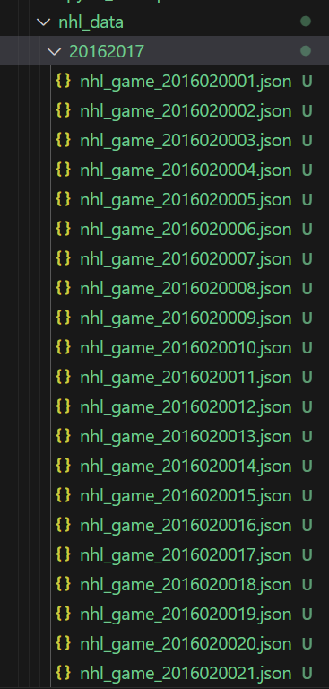
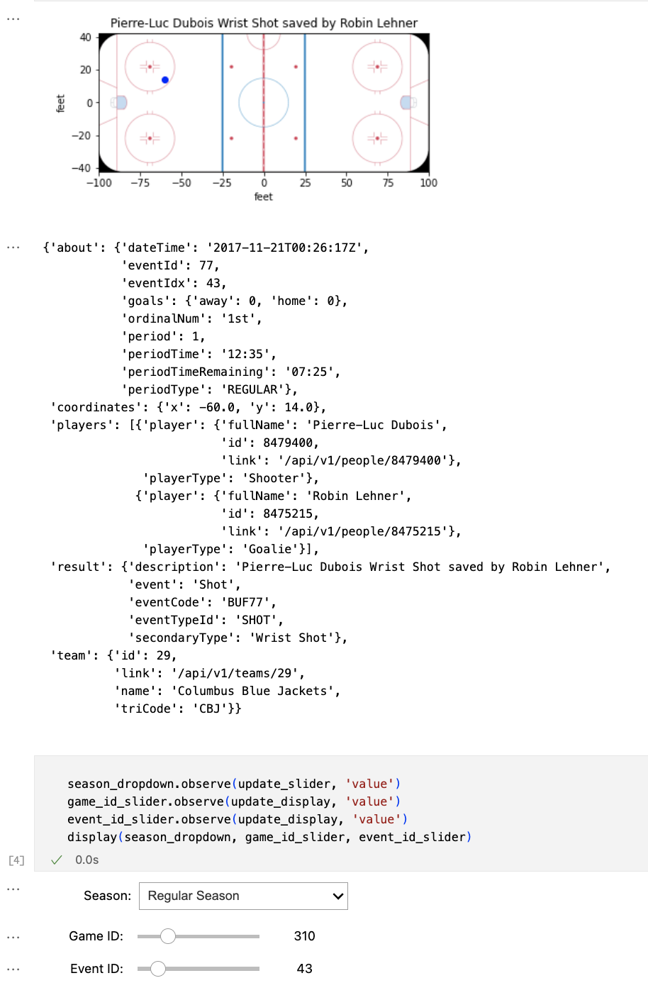
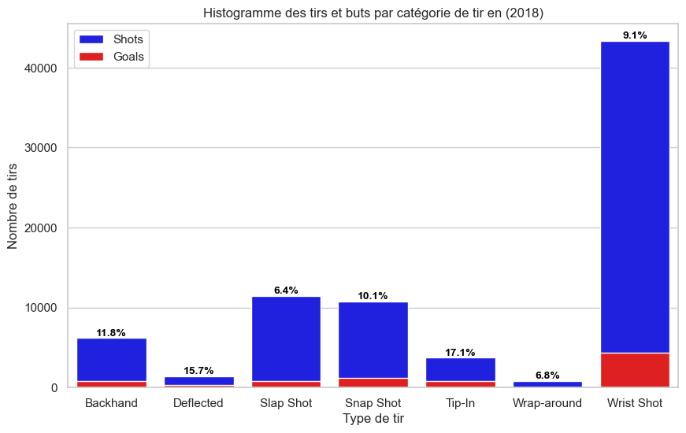
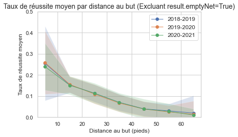
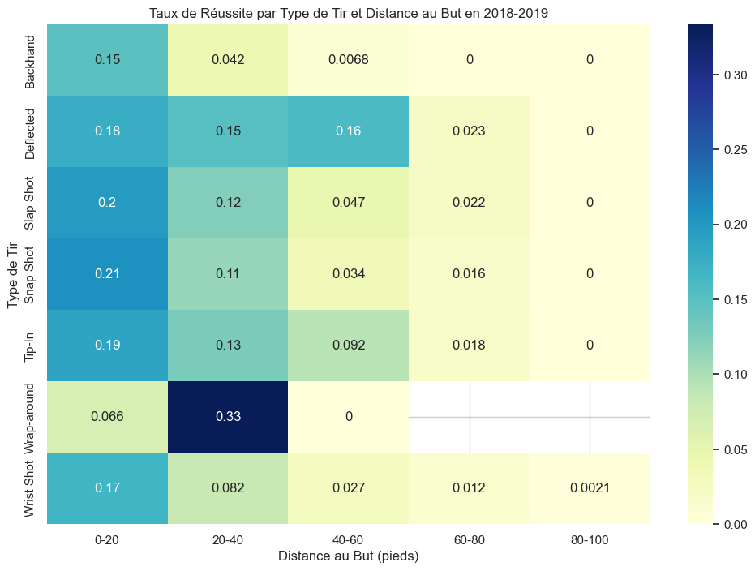
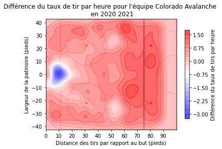
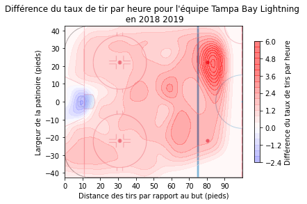
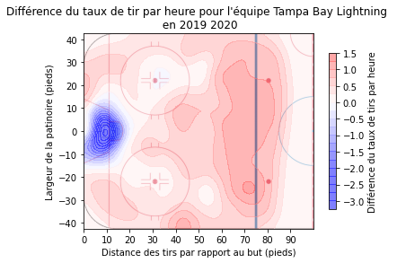
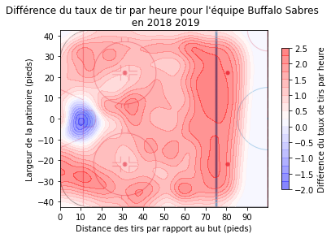
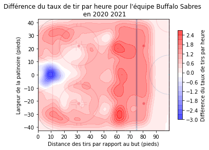

## Partie 1: Acquisition des données

**Tutoriel pour l'acquisition des données**<br>

L'API NHL Stats permet d'accéder à une multitude de données, notamment les calendriers des matchs, les statistiques des joueurs et les informations sur le jeu. Dans ce tutoriel, nous nous intéressons aux données play-by-play, qui comprennent des informations détaillées sur les événements pour chaque match de la NHL pour la saison régulière et la saison éliminatoire de l'année 2016-17 jusqu'à la saison 2020-21.

Nous allons créer une classe appelée NHLPBPDownloader pour gérer le processus de téléchargement des données. Voici comment l'initialiser :

```python
class NHLPBPDownloader:
    def __init__(self, data_dir):
        """
        Initializes an instance of NHLPBPDownloader.

        Args:
            data_dir (str): The directory where data will be stored.

        Attributes:
            base_url (str): The base URL for NHL data API.
            data_dir (str): The directory where data will be stored.

        """
        self.base_url = "https://statsapi.web.nhl.com/api/v1"
        self.data_dir = data_dir
    
```

Nous allons créer une méthode qui permet de télécharger les données d'une saison spécifique. Dans cette méthode, vous interagirez avec l'API NHL Stats pour récupérer les calendriers des matchs, puis vous téléchargerez les données play-by-play pour chaque match de la saison. Nous ajouterons également du code pour enregistrer localement les données téléchargées afin d'éviter de les retélécharger à l'avenir.


```python
	 def download_season_data(self, season):
        """
        Downloads and structures NHL play-by-play data for a given season.

        Args:
            season (str): The NHL season in the format "YYYYYYYY" (e.g., "20162017").

        Returns:
            None: Data is downloaded and stored in the specified directory.

        """
        season_dir = os.path.join(self.data_dir, str(season))
        os.makedirs(season_dir, exist_ok=True)
        # Vérifiez si les données existent localement
        season_file = os.path.join(data_dir, f"nhl_data_{season}.json")        
        if os.path.exists(season_file):
            # Si les données existent, chargez-les depuis le fichier
            with open(season_file, "r") as json_file:
                return json.load(json_file)
```
Si les données n'existent pas localement, le code les télécharge à partir de l'API NHL Stats. Il récupère d'abord la liste des matchs de la saison régulière et de la saison éliminatoire à l'aide des URL respectives. La bibliothèque requests est utilisée pour effectuer des requêtes HTTP vers ces URL, et les réponses sont converties au format JSON.

```python
else:
            # Si les données n'existent pas localement, téléchargez-les depuis l'API REST
            # Récupérez la liste des jeux pour la saison régulière
            season_reguliere_url = f"{self.base_url}/schedule?season={season}&gameType=R"
            response = requests.get(season_reguliere_url)
            schedule_reguliere_data = response.json()

            # Récupérez la liste des jeux pour la saison éliminatoire
            saison_eliminatoire_url = f"{self.base_url}/schedule?season={season}&gameType=P"
            response = requests.get(saison_eliminatoire_url)
            schedule_eliminatoire_data = response.json()
```
Cette partie du code parcourt les matchs de la saison régulière. Pour chaque match, elle récupère les données play-by-play en construisant l'URL de l'API spécifique à ce match. Elle vérifie ensuite si la réponse de l'API est réussie (pas d'erreur HTTP) en utilisant response.raise_for_status(). Les données de jeu sont enregistrées dans un fichier JSON nommé d'après l'ID du match dans le répertoire de la saison.

```python
# Récupération des données de saison régulière
            for game_date  in schedule_reguliere_data["dates"]:
                for game_info in game_date["games"]:
                    game_id = game_info["gamePk"]
                    play_by_play_url = f"{self.base_url}/game/{game_id}/feed/live/"
                    try:
                        response = requests.get(play_by_play_url)
                        response.raise_for_status()
                    except requests.exceptions.HTTPError as err:
                        raise SystemExit(err)
                    play_by_play_data = response.json()
                    season = str(game_info["season"])  # Convert season to a string
                    # Definir le path du fichier json pour enregistrer Data
                    game_file = os.path.join(season_dir, f"nhl_game_{game_id}.json")
                    # Define the directory path for the season
                    # Enregistrer Data dans json spécifique pour la saison réguliere
                    with open(game_file, "w") as json_file:
                        json.dump(play_by_play_data, json_file, indent=4)
```
- Comme pour la saison régulière, cette partie parcourt les matchs des séries éliminatoires. Elle récupère les données play-by-play et les enregistre dans des fichiers JSON dans le répertoire de la saison.
```python
            for game_date  in schedule_eliminatoire_data["dates"]:
                for game_info in game_date["games"]:
                    game_id = game_info["gamePk"]
                    play_by_play_url = f"{self.base_url}/game/{game_id}/feed/live/"
                    response = requests.get(play_by_play_url)
                    play_by_play_data = response.json()
                    # Definir le path du fichier json pour enregistrer Data
                    game_file = os.path.join(season_dir, f"nhl_game_{game_id}.json")
                    # Enregistrer Data dans json spécifique pour la saison éliminatoire
                    with open(game_file, "w") as json_file:
                            json.dump(play_by_play_data, json_file, indent=4)
```
Enfin, la fonction renvoie une fois que toutes les données de la saison, y compris les matchs de la saison régulière et des séries éliminatoires, ont été téléchargées et sauvegardées.

Cette fonction est conçue pour télécharger et enregistrer les données play-by-play de la LNH pour une saison spécifique. Elle vérifie si les données existent localement et les charge à partir du fichier si c'est le cas, ou les télécharge à partir de l'API NHL Stats si ce n'est pas le cas. Les données sont organisées dans des répertoires spécifiques à la saison, et les données de chaque match sont enregistrées dans un fichier JSON.

Voilà ! Toutes les fonctions nécessaires au téléchargement et à la structuration des données de la NHL ont été préparées. L'exécution du petit extrait de code suivant collectera et organisera les données de toutes les saisons (de 2016 à 2021) dans le dossier parent "/data/raw_data».

```python
if __name__ == "__main__":
    data_dir = "nhl_data"  # Répertoire de stockage des données
    downloader = NHLPBPDownloader(data_dir)
    
    start_year = 2016
    end_year = 2021

    for year in range(start_year, end_year + 1):
        # Convertir l'année au format approprié, e.g., "20162017" for the 2016-17 saison
        season = f"{year}{year + 1}"
        # Téléchargez les données pour la saison en cours
        season_data = downloader.download_season_data(season)
```



## Partie 2: Outil de débogage interactif

Nous avons ensuite nettoyé les données, afin de les transformées en pandas DataFrame, afin de pouvoir mieux les manipuler. 

Voici l'image de sortie générée à l'aide de l'outil interactif qui affiche la sortie de l'outil pour les choix suivants : "Type de match" ("regular") ; "Saison" ("2016") ; et pour "ID du match" ("0001"). Elle affiche également les statistiques pertinentes pour les options choisies.



Le code est ci-dessous :

```python
import datetime
import numpy as np
import pandas as pd
import plotly.graph_objects as go
import os
import json
from pprint import pprint
import matplotlib.pyplot as plt
import matplotlib.image as mpimg
from ipywidgets import widgets
from IPython.display import display, Image, clear_output
from ipywidgets import interact, interactive, fixed, interact_manual

#Folder of a given season 
file_path='/Users/ceciliaacosta/IFT-DATASCIENCE/nhl_data/20172018' #Enter the path to the folder of the season you want to analyze
#Path to the rink image
rink_image_path='nhl_rink.png' #Enter the path to the rink image
year=file_path[-8:-4]

# Get the total number and the ID's to use in the slider (LAST FOUR DIGITS) of regular season and playoff games
regular_games=[filename for filename in (os.listdir(file_path)) if filename[-11:-9]=='02']
total_regular_season_games = len(regular_games)
idx_regular_games=sorted([int(id.rstrip('.json')[-4:]) for id in regular_games])

playoff_games = [filename for filename in (os.listdir(file_path)) if  filename[-11:-9]=='03']
total_playoff_games=len(playoff_games)
idx_playoff_games=sorted([int(id.rstrip('.json')[-3:]) for id in playoff_games])


def get_coordinates(nested_data, event_id):
    
    x=nested_data[event_id].get('coordinates').get('x',None)
    y=nested_data[event_id].get('coordinates').get('y',None)

    return x, y 

#load data
def load_data(game_ID, season):
    global file_path
    if season=='regular_season':
        season_code='02'
    else:
        season_code='03'

    if len(str(game_ID))==1:
        files_game = f"{file_path}/nhl_game_{year}{season_code}000{game_ID}.json"
    if len(str(game_ID))==2:
        files_game = f"{file_path}/nhl_game_{year}{season_code}00{game_ID}.json"
    if len(str(game_ID))==3:
        files_game = f"{file_path}/nhl_game_{year}{season_code}0{game_ID}.json"
    if len(str(game_ID))==4:
        files_game = f"{file_path}/nhl_game_{year}{season_code}{game_ID}.json"

    if os.path.exists(files_game):

        with open(files_game, 'r') as file:
            return json.load(file)
    else:
        return None

output = widgets.Output()
def display_game_events(game_data):

    allplays_path=['liveData', 'plays', 'allPlays']
    nested_data = game_data

    #Update the event ID slider (aka the index in the list of events)
    for key in allplays_path:
        nested_data = nested_data.get(key, {})
    event_id_slider.max=len(nested_data)-1
    event_id = event_id_slider.value
    # with output:
    clear_output(wait=True)

    if game_data:
        x_coord, y_coord=get_coordinates(nested_data, event_id)
        if x_coord== None and y_coord==None:
            pprint(nested_data[event_id])
            event_type=nested_data[event_id].get('result',{}).get('description',"")
        else:
            event_type=nested_data[event_id].get('result',{}).get('description',"")
# Display event information on the ice rink image
            # Load the rink image to get its dimensions
            rink_image = mpimg.imread(rink_image_path)
            fig, ax = plt.subplots()
            ax.patch.set_facecolor('black')
            im = ax.imshow(rink_image, origin='lower', extent=[-100, 100, -42, 42])
            ax.plot(x_coord,y_coord, 'bo')
            ax.set_title(f'{event_type}')
            ax.set_xlabel('feet')
            ax.set_ylabel('feet')
            plt.show()
            pprint(nested_data[event_id])

    # Function to update the display based on the selected season and game ID
def update_display(change):
    season = 'regular_season' if season_dropdown.value == 'Regular Season' else 'playoffs'
    game_id = game_id_slider.value
    game_data = load_data(game_id, season)

    if game_data:
        display_game_events(game_data)

    else:

        print(f"Game data not found for Game ID {game_id} in the {season}.")


# Attach the update_display function to the widgets' observe methods
# Create a dropdown widget to select the season
season_dropdown = widgets.Dropdown(
    options=['Regular Season', 'Playoffs'],
    description='Season:',
)

#Create an IntSlider for Game ID with a maximum value that depends on the selected season
game_id_slider = widgets.IntSlider(
    min=1,
    max=total_regular_season_games,
    description='Game ID:',
    continuous_update=False,
    options=idx_regular_games
)

event_id_slider = widgets.IntSlider(
    min=0,
    max=0,  # Initialize with 0 events
    description='Event ID:',
    continuous_update=False,
)

#Function to update the slider based on the selected type of Season 
def update_slider(change):
    if season_dropdown.value == 'Regular Season':
        game_id_slider.max = max(idx_regular_games)
        game_id_slider.min = min(idx_regular_games)
        game_id_slider.options=idx_regular_games

    else:
        game_id_slider.max = max(idx_playoff_games)
        game_id_slider.min= min(idx_playoff_games)
        game_id_slider.options=idx_playoff_games

# Attach the update_display function to the widgets' observe methods
# Create a dropdown widget to select the season
season_dropdown = widgets.Dropdown(
    options=['Regular Season', 'Playoffs'],
    description='Season:',
)

season_dropdown.observe(update_slider, 'value')
game_id_slider.observe(update_display, 'value')
event_id_slider.observe(update_display, 'value')

display(output)
update_display(None) 

# Display the widgets
season_dropdown.observe(update_slider, 'value')
game_id_slider.observe(update_display, 'value')
event_id_slider.observe(update_display, 'value')
display(season_dropdown, game_id_slider, event_id_slider)

```
## Partie 3 - Nettoyage des données


**Réponse 3.1: De dictionnaires .JSON à Pandas DataFrame .csv**<br>


Nous avons ensuite nettoyé les données, afin de les transformées en pandas DataFrame, et enregistrer les données dans un fichier CSV. Nous travaillons donc avec un fichier CSV par saison.

Voici un example des premières lignes du fichier CSV de la saison 2016-2017:


**Réponse 3.2: Comment pourrait-on obtenir le nombre réel de joueurs sur la glace lors d'un tir?**<br>

Au Hockey, les avantages numériques ou désavantages sont déterminés par les pénalités qui sont effectives pour certaines périodes de temps. C’est possible de trouver l’information sur la force réelle, en 
Dans tous les jeux (“allPlays”) on peut retrouver le type d’événement “PENALTY” donné dans “eventTypeId” sous la clé “result” de l'événement en question. Ce type d’événement indique qu’il y aura un joueur de moins dans une équipe durant les 2, 5 ou 10 prochaines minutes (dépendamment de la gravité de la pénalité). On trouve l’information dans “result”: “penaltyMinutes” du .json file pour la partie qui nous intéresse. 

Dans tous les jeux (“allPlays”) on peut retrouver le type d’événement “PENALTY” donné dans “eventTypeId” sous la clé “result” de l'événement en question. Ce type d’événement indique qu’il y aura un joueur de moins dans une équipe durant les 2, 5 ou 10 prochaines minutes (dépendamment de la gravité de la pénalité). On trouve l’information dans “result”: “penaltyMinutes” du .json file pour la partie qui nous intéresse. 

Ainsi, on créer une nouvelle colonne à notre DataFrame nommée “force.réelle” où nous avons le nombre de joueurs pour chaque équipe, et les valeurs sont une liste de deux éléments. Tous les événements commencent avec une valeur par défaut de [5,5]. Le premier élément représente le nombre de joueurs sur la glace de l’équipe qui reçoit et le deuxième celui qui visite. 
Pour trouver le temps exact où la pénalité est effective, nous devons trouver l’événement de type “FACEOFF” qui suit l’événement de pénalité. Il faut tenir en compte que l’événement “FACEOFF” ne suit pas toujours immédiatement la pénalité. 

Finalement, grâce à l’information “date.Time” de l’événement “FACEOFF”, on peut déterminer tous les tirs et buts qui se trouvent dans l'intervalle de temps où une pénalité est en cours . Il faudrait utiliser le module datetime et timedelta de la librairie datetime. 


**Réponse 3.3: Autres données à explorer**<br>

À partir des données disponibles, il est possible d’envisager plusieurs analyses supplémentaires qui seront décrites dans cette section du blog pour vous inspirer pour vos analyses personnelles. En voici une liste:

*Rebonds*: Pour trouver les tirs ou les buts qui ont été effectué en tant que rebond, il suffit d’identifier principalement avec les colonnes ‘about.dateTime’, ‘result.eventTypeId’, et ‘team.name’ les tirs ou les buts effectués par la même équipe dans un intervalle de 5 secondes.

*Tirs en contre-attaque*: Par le même principe décrit ci-haut pour les rebonds, les tirs en contre-attaque peuvent être identifiés en utilisant les mêmes colonnes: ‘about.dateTime’, ‘result.eventTypeId’, et ‘team.name’. Il suffit de sélectionner les tirs effectués par la seconde équipe dans un intervalle de 2 minutes après un tir de la première équipe. 

*Constance offensive des équipes*: Une des statistiques les plus regardées pour les joueurs mais aussi les équipes sont les +/-. C’est un système assez simple qui donne un point si l’équipe marque et en soustrait un si l’équipe se fait marquer un but et permet de voir l’équilibre entre l’offensive et la défensive d’une équipe. En sélectionnant que les ‘result.eventTypeId’ de type == ‘Goal’, les ‘team.name’ ainsi que ‘about.period’ il est possible de calculer pour chaque période le +/- de chaque équipe. Cette statistique permettrait d’analyser la tendance qu'ont les équipes à accorder plus de buts en deuxième période ou de commencer fort avec une tendance +/- fortement positive en première période. 

*Prédilection de technique offensive en supériorité numérique*: Grâce à notre nouvelle colonne ‘force.réelle’ mentionné dans notre dernière publication qui contient l’information sur la quantité de joueurs de chaque équipe sur la glace, il est possible d’identifier tous les ‘result.eventTypeId’ de type == ‘Shot’ et ‘Goal’ et de regarder les coordonnées en x et y sur la patinoire avec les colonnes respectives. Il sera donc possible d’effectuer des analyses de densité pour établir les régions de tirs privilégiées par chaque équipe durant les avantages numériques. Il sera aussi possible d’établir pour chaque équipe les régions de tirs qui semblent le plus efficaces pour marquer des buts en avantages numériques.

*Faiblesse défensive en infériorité numérique*: Tout comme pour la prédilection de technique offensive en supériorité numérique, nous pouvons utiliser notre nouvelle colonne ‘force.réelle’ qui contient l’information sur la quantité de joueurs de chaque équipe sur la glace, il est possible d’identifier tous les ‘result.eventTypeId’ de type == 'Shot’ et ‘Goal’ et de regarder les coordonnées en x et y sur la patinoire avec les colonnes respectives. Il sera donc possible d’effectuer des analyses de densité pour établir les régions de tirs et de buts contre chaque équipe lorsqu’elle est en infériorité numérique. Ceci permettra d’identifier les zones plus vulnérables défensivement de chaque équipe en infériorité numérique en montrant les zones d’où proviennent les tirs et les buts. 


## Partie 4 - Simples Visualisations
**Réponse 4.1**<br>

*Fig 1: Histogrammes des tirs (bleu) et buts (rouge) par type de tir pendant la saison 2018-2019. Les pourcentages en haut de chaque barres représentent le pourcentage de buts par rapport au nombre de tirs pour chaque type de tir.*

Il est facile avec les graphiques par équipe de voir que le tir le plus effectué est le 'Wrist Shot' et c'est le cas pour toutes les équipes. Pour ce qui est du tir le plus efficace en terme de tirs qui occasionnent le plus de but nous avons deux types de tirs qui se démarquent : le 'Deflected' qui est le meilleur pour 13 équipes et le 'Tip-In' qui est le meilleur pour 12 équipes. Nous avons choisi le bar plot justement parce qu'il est facile de voir en un seul coup d'œil pour chaque équipe quels sont les tirs les plus utilisés et l'efficacité de chacun des types de tirs pour marquer des buts.

**Réponse 4.2**<br>

*Fig 2: Graphique du taux moyen de réussite par intervalle de distance pour les saisons 2018-2019, 2019-2020 et 2020-2021. Les données sont présentées en taux de réussite des tirs au buts.*

En regardant le graphique du taux moyen de réussite des tirs au buts pour les saisons 2018-2019, 2019-2020 et 2020-2021, il est possible d’observer une tendance générale avec peu de changements dans les dernières années: plus les tirs sont effectués près du filet, plus la chance de marquer est grande et plus on s’éloigne, plus les chances diminuent. Nous avons décidé de retirer les buts dans les filets déserts parce qu’ils causaient du bruit selon nous dans les données, surtout dans les données de tirs à distance. Comme ils apportent peu d’informations pertinentes dans la dangerosité des tirs, nous les avons retirés. 

Nous avons choisi ce type de graphique parce qu’il donne beaucoup d'informations en un seul coup d'œil et permet de voir la tendance sur les différentes saisons. 

**Réponse 4.3**<br>

*Fig 3: Carte de densité pour représenté le taux de réussite des tirs aux but en combinant les données de différents types de tirs avec les distances*

En général, plus un tir est effectué près du filet, plus il a de chance d'être efficace. Il semble y avoir une erreur dans le data set car c'est un tir normalement effectué près du gardien en 'rebond' sur un tir précédant normalement et ne serait très peu probablement effectué à 40-60 pieds du filet. De façon évidente, les tirs “deflected" sont les plus efficaces. Il est normal de penser ceci car cela veut dire que le tir a été dévié et a changé de trajectoire entre le tir et le filet souvent par un joueur positionné devant le gardien lui bloquant donc également la vue. Après les tirs de type “deflected”, les tirs en général les plus efficaces sont les “Slap Shot” et les “snap shot” qui sont efficaces sur une distance plus grande de par la force du tir comparé aux autres types de tirs.

## Partie 5 - Visualisations avancées


**5.1 - Graphique interactif pour chaque saison de 2016-17 à 2020-2021**

Nous avons créer un graphique interactif qui permettra de visualiser les cartes de tirs de chaque équipe pour chaque saison de 2016-17 à 2020-2021. Il est possible de sélectionner l’équipe désirée dans le menu déroulant et la saison désirée dans le menu déroulant. 

[Advanced Visualization Shot Map Plot](https://nhlhockeyapp.onrender.com/)


**Réponse 5.2 - Interprétation des graphiques**<br>

Les graphiques de zones offensives en équipe peuvent être utilisés pour obtenir beaucoup d'informations en un coup d'œil sur les stratégies offensives d’une équipe comparé au reste de la ligue nationale. En comparant avec les autres équipes de la ligue, il est possible de voir à quel point une équipe diffère de par ses stratégies offensives en mettant en évidence les zones d’où proviennent le plus de tirs et permet aussi d’identifier en quelque sorte les stratégies offensives de chaque équipe (favorise les tirs de la ligne bleue vs tirs rapprochés seulement). D’un autre point de vue, elle permet également de reconnaître pour chaque équipe des régions de la glace moins utilisée qui pourrait être de l’information pertinente si on désire faire de nouvelles stratégies offensives. Elle permet également de comparer la tendance chez les équipes ayant du succès dans la saison avec celle chez les équipes au fond du classement pour avoir une idée de la tendance des stratégies offensives les plus payantes dans la saison actuelle.

**Réponse 5.3 - L'Ascension des Avalanches du Colorado**<br>


En regardant la carte de tirs de 2016-2017 de l’Avalanche du Colorado qui était dernier au classement de la conférence de l’Ouest, on se rend compte que comparé aux autres équipes de la ligue nationale, ils tiraient moins de la région près du but, ni du centre de la glace entre les deux cercles de mise au jeu. Les tirs venaient plus de la ligne bleu offensive témoignant en quelque sorte d’une difficulté de l’équipe à pénétrer en zone offensive et d’effectuer des tirs rapprochés, qui comme nous l’avons vu précédemment, sont les tirs les plus dangereux en terme de chance de marquer. 



En regardant la carte de tir de 2020-2021, une année où l’Avalanche du Colorado était au sommet du classement, il est possible d’identifier une augmentation comparé aux autres équipes des tirs au centre de la glace. En fait, excepté devant le filet, il semble que l’Avalanche tire plus près du but, plus au centre et également plus de la ligne bleue. Comme nous l’avons vu auparavant, les tirs déviés (provenant d’une certaine distance du but) et les tirs effectués les plus près du filet adverse sont les plus dangereux. Le fait que la zone près du gardien soit moins utilisée par l’Avalanche comparé aux autres peut s’expliquer par le fait un probable style de jeu où on favorise les tirs déviés et les chances de marquer par tirs au centre de la patinoire et que si leurs tirs sont plus efficaces, il y a moins de rebonds, donc moins de tirs à proximité. 


**Réponse 5.4 - Buffalo Sabres vs. Tampa Bay Lightning**<br>

En comparant ici l’une des pires équipes de la ligue nationale dans les dernières années, les Sabres de Buffalo, à l’une des équipes avec le plus de succès des dernières années, le Lightning, il est intéressant de réaliser que ces cartes offensives ne permettent pas de totalement comprendre la différence entre le succès d’une équipe comparé à une autre. En général, les 2 équipes produisent des tirs de la ligne bleue, des tirs en périphérie et quelques tirs au centre de la patinoire. Il est percutant de voir que les cartes sont relativement semblables entre ces équipes à succès très différents. Possiblement que l’équipe de Tampa Bay tire plus au centre et près du but que l’autre équipe, mais pas une différence qui, selon nous, pourrait expliquer une telle différence au classement. Évidemment, cette carte ne prend pas en compte l’expérience ou le talent des joueurs des deux équipes: les Sabres étant une équipe en reconstruction compte parmi elle beaucoup plus de jeunes joueurs avec moins d’expérience comparé à une équipe remplie de joueurs talentueux et d’expérience. De plus, aucune information est connue sur les gardiens de buts ainsi que la défensive de ces deux équipes qui pourrait totalement expliquer les différences de succès. Il serait d’intérêt pour notre prochain article de blog de comparer ces données, sachant que le Lightning possédait dans ces années l’une des meilleures défensives de la ligue et l’un des meilleurs gardiens de but
uffalo Sabres and Tampa Bay Lightning**


Cartes montrant la différence du taux de tirs du Lightning de Tampa Bay par rapport à la moyenne de la ligue dans les saisons 2018-19, 2019-20, et 2020-21:





Cartes montrant la différence du taux de tirs des Sabres de Buffalo par rapport à la moyenne de la ligue  2018-19, 2019-20, et 2020-21:





